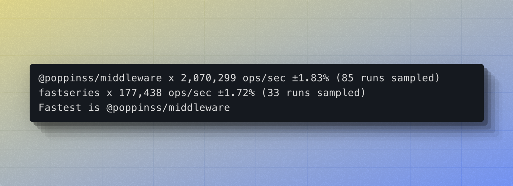

# @poppinss/middleware
> Implementation of the chain of responsibility design pattern.

[![gh-workflow-image]][gh-workflow-url] [![typescript-image]][typescript-url] [![npm-image]][npm-url] [![license-image]][license-url]

This package is a zero-dependency implementation for the chain of responsibility design pattern, also known as the middleware pipeline.



## Setup
Install the package from the npm packages registry.

```sh
npm i @poppinss/middleware

# yarn lovers
yarn add @poppinss/middleware
```

And import the `Middleware` class as follows.

```ts
import Middleware from '@poppinss/middleware'
import { NextFn } from '@poppinss/middleware/types'

const context = {}
type MiddlewareFn = (
  ctx: typeof context,
  next: NextFn
) => void | Promise<void>

const middleware = new Middleware<MiddlewareFn>()

middleware.add((ctx, next) => {
  console.log('executing fn1')
  await next()
})

middleware.add((ctx, next) => {
  console.log('executing fn2')
  await next()
})

await middleware
  .runner()
  .run((fn, next) => fn(context, next))
```

## Defining middleware

The middleware handlers are defined using the `middleware.add` method. The middleware function can be represented as any value you wish. For example:

**The middleware can be a function**
```ts
const middleware = new Middleware()

middleware.add(function () {
  console.log('called')
})
```

**Or it can be an object with `handle` method**
```ts
const middleware = new Middleware()
function authenticate() {}

middleware.add({ name: 'authenticate', handle: authenticate })
```

### Passing data to middleware
Since, you are in control of executing the underlying middleware function. You can pass any data you want to the middleware.

```ts
const context = {}

type MiddlewareFn = (
  ctx: typeof context,
  next: NextFn
) => void | Promise<void>

const middleware = new Middleware<MiddlewareFn>()

middleware.add(function (ctx, next) {
  assert.deepEqual(ctx, context)
  await next()
})

const runner = middleware.runner()
await runner.run((fn, next) => fn(context, next))
```


### Final Handler
The final handler is executed when the entire middleware chain ends by calling `next`. This makes it easier to execute custom functions that are not part of the chain but must be executed when it ends.

```js
const context = {
  stack: [],
}

type MiddlewareFn = (
  ctx: typeof context,
  next: NextFn
) => void | Promise<void>

const middleware = new Middleware<MiddlewareFn>()

middleware.add((ctx: typeof context, next: NextFn) => {
  ctx.stack.push('fn1')
  await next()
})

await middleware
  .runner()
  .finalHandler(() => {
    context.stack.push('final handler')
  })
  .run((fn, next) => fn(context, next))

assert.deepEqual(context.stack, ['fn1', 'final handler'])
```

### Error handler
By default, the exceptions raised in the middleware pipeline are bubbled upto the `run` method and you can capture them using `try/catch` block. Also, when an exception is raised, the middleware downstream logic will not run, unless middleware internally wraps the `next` method call inside `try/catch` block.

To simply the exception handling process, you can define a custom error handler to catch the exceptions and resume the downstream flow of middleware.

```ts
const context = {
  stack: [],
}

type MiddlewareFn = (ctx: typeof context, next: NextFn)
const middleware = new Middleware<MiddlewareFn>()

middleware.add((ctx: typeof context, next: NextFn) => {
  ctx.stack.push('middleware 1 upstream')
  await next()
  ctx.stack.push('middleware 1 downstream')
})

middleware.add((ctx: typeof context, next: NextFn) => {
  ctx.stack.push('middleware 2 upstream')
  throw new Error('Something went wrong')
})

middleware.add((ctx: typeof context, next: NextFn) => {
  ctx.stack.push('middleware 3 upstream')
  await next()
  ctx.stack.push('middleware 3 downstream')
})

await middleware
  .runner()
  .errorHandler((error) => {
    console.log(error)
    context.stack.push('error handler')
  })
  .finalHandler(() => {
    context.stack.push('final handler')
  })
  .run((fn, next) => fn(context, next))

assert.deepEqual(context.stack, [
  'middleware 1 upstream',
  'middleware 2 upstream',
  'error handler',
  'middleware 1 downstream'
])
```

[gh-workflow-image]: https://img.shields.io/github/actions/workflow/status/poppinss/middleware/checks.yml?style=for-the-badge
[gh-workflow-url]: https://github.com/poppinss/middleware/actions/workflows/checks.yml "Github action"

[typescript-image]: https://img.shields.io/badge/Typescript-294E80.svg?style=for-the-badge&logo=typescript
[typescript-url]: "typescript"

[npm-image]: https://img.shields.io/npm/v/@poppinss/middleware.svg?style=for-the-badge&logo=npm
[npm-url]: https://npmjs.org/package/@poppinss/middleware 'npm'

[license-image]: https://img.shields.io/npm/l/@poppinss/middleware?color=blueviolet&style=for-the-badge
[license-url]: LICENSE.md 'license'
